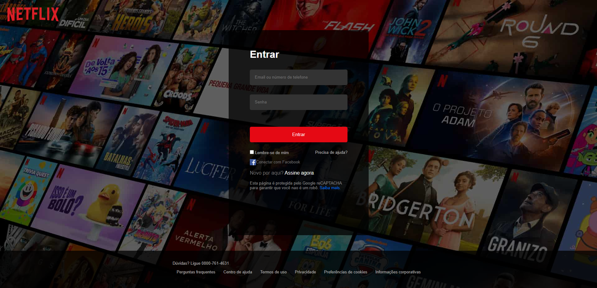

## 🎥 Netflix Login UI Clone🎞️

  

### 🚀 Sobre

Projeto criado como partes dos meus estudos em HTML5 e CSS3 pela Rocketseat. Utilizando apenas essas tecnologias, desenvolvi um clone da interface de login do Netflix.

### 🖼️ Imagens



### 🏃‍♂️ Como rodar o projeto

Realize um clone do repositório, abra a pasta e execute o arquivo index.html:
```bash
git clone https://github.com/Seiixas/netflix-login-clone
cd netflix-login-clone
```

Ou acesse o site on-line pelo Github Pages: https://seiixas.github.io/netflix-login-clone/.